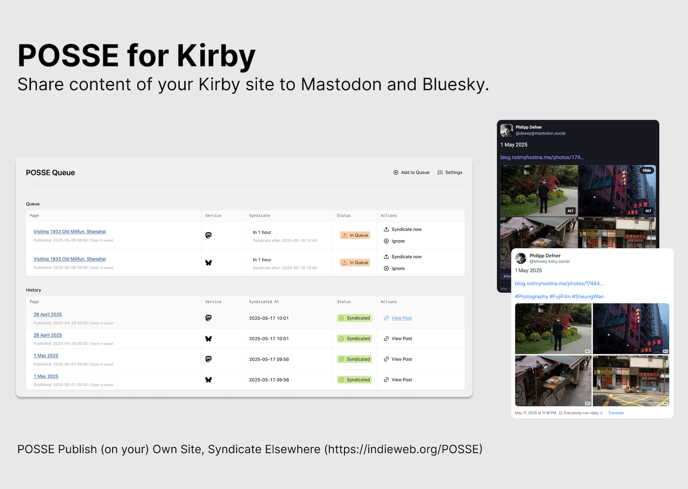

# POSSE Plugin for Kirby

This plugin enables Publish (on your) Own Site, Syndicate Elsewhere (POSSE) functionality for your Kirby site. Automatically syndicate your posts to Mastodon and Bluesky (For now), or manually decide which ones you want to syndicate.



## Features

- Automatically syndicates your posts to Mastodon and Bluesky
- Customizable post template with support for title, URL and tags
- Queue system for managing which posts get syndicated when
- Configurable delay before syndication (To fix typos, etc.)
- Support for syndication image limits (Up to 4 images) and image size presets
- Automated cron job endpoint for scheduled syndication
- SQLite database for storing syndication history and queue

## Installation

1. Download or clone this repository to `/site/plugins/posse`
2. Configure the plugin through the Panel at "POSSE > Settings"

Optional: Add `/site/db/posse.sqlite` and `/site/config/posse.yml` to `.gitignore` for git-based deployment strategies.

## Configuration

Everything related to the plugin can be configured through the Kirby Panel. The automated syndication feature requires Basic Auth to be enabled in your config.php:

```php
return [
    'api.basicAuth' => true
];
```

### Configuration File Structure

The plugin stores all settings in a YAML file at `site/config/posse.yml`, making settings persistent even when reinstalling the plugin. The `posse.yml` file contains all plugin settings with the following structure:

```yaml
# Content types to track (post, photo, etc.)
contenttypes:
  post: true
  photo: true

# Delay in minutes before syndication
syndication_delay: 60

# Post template using placeholders: {{title}}, {{url}}, {{tags}}
template: |
  {{title}}

  {{url}}

  {{tags}}

services:
  mastodon:
    enabled: true
    instance_url: https://mastodon.social
    api_token: your-api-token
    image_limit: 4
  bluesky:
    enabled: true
    instance_url: https://bsky.social
    api_token: yourname.bsky.social:1234-4567-...
    image_limit: 4
```

## Database

The plugin uses SQLite to store the syndication history and queue. The database file is automatically created and located at:

```
/site/db/posse.sqlite
```

This database tracks which posts have been syndicated to which services and manages the queue of pending syndications.

## Automated Syndication

To set up automated syndication with a cron job:

1. Make sure Basic Auth is enabled in your config.php
2. Set up a cron job that runs a few times per hour. In this example every 10 minutes:

```
*/10 * * * * curl -s -u "USERNAME:PASSWORD" "https://yourdomain.com/api/posse/cron-syndicate" > /dev/null 2>&1
```

Replace USERNAME and PASSWORD with your Kirby panel credentials.

For monitoring with Healthchecks.io:

```
*/10 * * * * curl -s -u "USERNAME:PASSWORD" "https://yourdomain.com/api/posse/cron-syndicate" && curl -fsS -m 10 https://hc-ping.com/YOUR-UUID > /dev/null 2>&1
```

## Post Templates

The post template supports these placeholders:

- `{{title}}` - The post title
- `{{url}}` - The URL to your post
- `{{tags}}` - Hashtags generated from the post's tags

Example template:
```
{{title}}

{{url}}

{{tags}}
```

## License

MIT License
